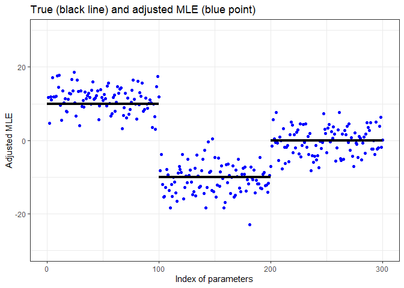

MLE Adjustment for High-Dimensional Logistic Regression
================
Koji Makiyama (@hoxo-m)

<!-- README.md is generated from README.Rmd. Please edit that file -->

## Overview

The maximum likelihood estimator (MLE) of the logistic regression model
is not an unbiased estimator. Therefore, estimates calculated with
`glm()` contain bias. Since the MLE satisfies consistency and asymptotic
normality, the bias can be disregarded when the sample size is large.
However, in the analysis of high-dimensional data, the sample size is
sometimes relatively small compared to the dimension of input variables.

For example, let’s consider a scenario where the number of input
variables `p = 240`, and the sample size `n = 1200`. Additionally, the
true parameters `beta` consist of

- `beta = 10` for the first 1/3,
- `beta = -10` for the next 1/3, and
- `beta = 0` for the remaining 1/3.

In such a case, the MLE returned by `glm()` contains a non-negligible
bias.

``` r
p <- 240
n <- 1200

set.seed(314)
x <- rnorm(n * p, mean = 0, sd = sqrt(1/n))
X <- matrix(x, nrow = n, ncol = p)
beta <- rep(c(10, -10, 0), each = p/3)
prob <- plogis(X %*% beta)
y <- rbinom(n, 1, prob)

fit <- glm(y ~ X, family = binomial, x = TRUE)

library(ggplot2)
theme_set(theme_bw())
df <- data.frame(index = seq_len(p), mle = coef(fit)[-1])
ggplot(df, aes(index, mle)) +
  geom_point(color = "blue") +
  annotate("segment", x = c(0, 80, 160), xend = c(80, 160, 240), 
           y = c(10, -10, 0), yend = c(10, -10, 0), linewidth = 1.5) +
  scale_x_continuous(breaks = c(0, 80, 160, 240)) +
  ylim(-50, 50) + xlab("Index of parameters") + ylab("MLE") +
  ggtitle("True (black line) and MLE (blue point)")
```

<!-- -->

You can see that the blue points (MLE) are significantly outside the
perimeter of the black line (true).

The purpose of this package is to alleviate the bias by adjusting the
MLE. To achieve this, we implemented two methods:

- “ProbeFrontier,” as proposed by Sur and Candès (2018), and
- “SLOE,” as proposed by Yadlowsky et al. (2021).

The `adjustMLE` function in our package is designed to mitigate this
bias.

``` r
library(adjustMLE)

fit_adj <- adjustMLE(fit)

df <- data.frame(index = seq_len(p), mle = coef(fit_adj)[-1])
ggplot(df, aes(index, mle)) +
  geom_point(color = "blue") +
  annotate("segment", x = c(0, 80, 160), xend = c(80, 160, 240), 
           y = c(10, -10, 0), yend = c(10, -10, 0), linewidth = 1.5) +
  scale_x_continuous(breaks = c(0, 120, 240, 360)) +
  ylim(-30, 30) + xlab("Index of parameters") + ylab("Adjusted MLE") +
  ggtitle("True (black line) and adjusted MLE (blue point)")
```

<!-- -->

## Installation

You can install the package from GitHub.

``` r
install.packages("remotes") # if you have not installed "remotes" package
remotes::install_github("hoxo-m/adjustMLE")
```

## Related Work

- glmhd (R package on GitHub)
  - <https://github.com/zq00/glmhd>
- SLOE (Python code)
  - <https://github.com/google-research/sloe-logistic>

## References

- Sur, P., & Candès, E.J. (2018). A modern maximum-likelihood theory for
  high-dimensional logistic regression. Proceedings of the National
  Academy of Sciences of the United States of America, 116, 14516 -
  14525.
- Yadlowsky, S., Yun, T., McLean, C.Y., & D’Amour, A. (2021). SLOE: A
  Faster Method for Statistical Inference in High-Dimensional Logistic
  Regression. Neural Information Processing Systems.
