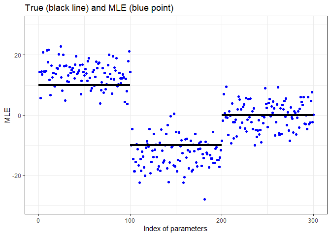

MLE Adjustment for High-Dimensional Logistic Regression
================
Koji Makiyama (@hoxo-m)

<!-- README.md is generated from README.Rmd. Please edit that file -->

## Overview

The maximum likelihood estimator (MLE) of the logistic regression model
is not an unbiased estimator. Therefore, estimates calculated with
`glm()` contain bias. Since the MLE satisfies consistency and asymptotic
normality, the bias can be disregarded when the sample size is large.
However, in the analysis of high-dimensional data, the sample size is
sometimes relatively small compared to the dimension of input variables.

The goal of the package is to alleviate bias by adjusting the MLE. To
achieve this, we implemented a method called “ProbeFrontier,” as
proposed by Sur and Candès (2019).

For example, let’s consider a scenario where the number of input
variables p = 180, and the true parameters consist of 10 for the first
1/3, -10 for the next 1/3, and 0 for the remaining 1/3. Additionally,
consider the sample size n = 900. In such a case, the MLE returned by
`glm()` contains a non-negligible bias.

``` r
n <- 900
p <- 180

set.seed(314)
x <- rnorm(n * p, mean = 0, sd = sqrt(1/n))
X <- matrix(x, nrow = n, ncol = p)
beta <- c(rep(10, 60), rep(-10, 60), rep(0, 60))
prob <- 1 / (1 + exp(-(X %*% beta)))
y <- rbinom(n, 1, prob)

fit <- glm(y ~ X, family = binomial, x = TRUE)

library(ggplot2)
theme_set(theme_bw())
df <- data.frame(index = seq_len(p), mle = coef(fit)[-1])
ggplot(df, aes(index, mle)) +
  geom_point(color = "blue") +
  annotate("segment", x = c(0, 60, 120), xend = c(60, 120, 180), 
           y = c(10, -10, 0), yend = c(10, -10, 0), linewidth = 1.5) +
  scale_x_continuous(breaks = c(0, 60, 120, 180)) +
  ylim(-40, 40) + xlab("Index of parameters") + ylab("MLE") +
  ggtitle("True (black line) and MLE (blue point)")
```

<!-- -->

You can observe that the blue points (MLE) are significantly outside the
perimeter of the black line (true).

The `adjustMLE` function in our package is designed to mitigate this
bias.

``` r
library(adjustMLE)

fit_adj <- adjustMLE(fit)

df <- data.frame(index = seq_len(p), mle = coef(fit_adj)[-1])
ggplot(df, aes(index, mle)) +
  geom_point(color = "blue") +
  annotate("segment", x = c(0, 60, 120), xend = c(60, 120, 180), 
           y = c(10, -10, 0), yend = c(10, -10, 0), linewidth = 1.5) +
  scale_x_continuous(breaks = c(0, 60, 120, 180)) +
  ylim(-40, 40) + xlab("Index of parameters") + ylab("Adjusted MLE") +
  ggtitle("True (black line) and adjusted MLE (blue point)")
```

<!-- -->

## Installation

You can install the package from GitHub.

``` r
install.packages("remotes") # if you have not installed "remotes" package
remotes::install_github("hoxo-m/adjustMLE")
```

## Related Work

- SLOE (Python)
  - <https://github.com/google-research/sloe-logistic>

## References

- Sur P, Candès EJ. A modern maximum-likelihood theory for
  high-dimensional logistic regression. Proc Natl Acad Sci U S A. 2019
  Jul 16;116(29):14516-14525. doi: 10.1073/pnas.1810420116. Epub 2019
  Jul 1. PMID: 31262828; PMCID: PMC6642380.
